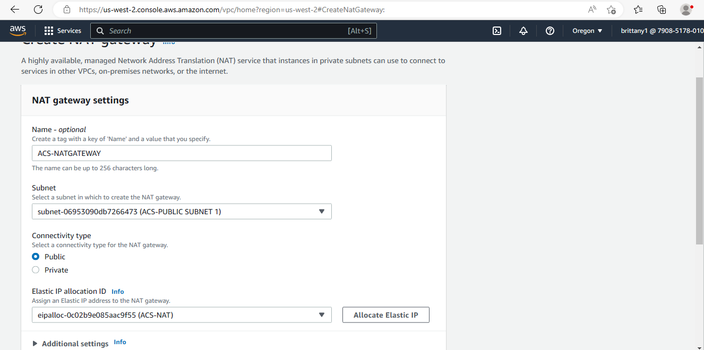
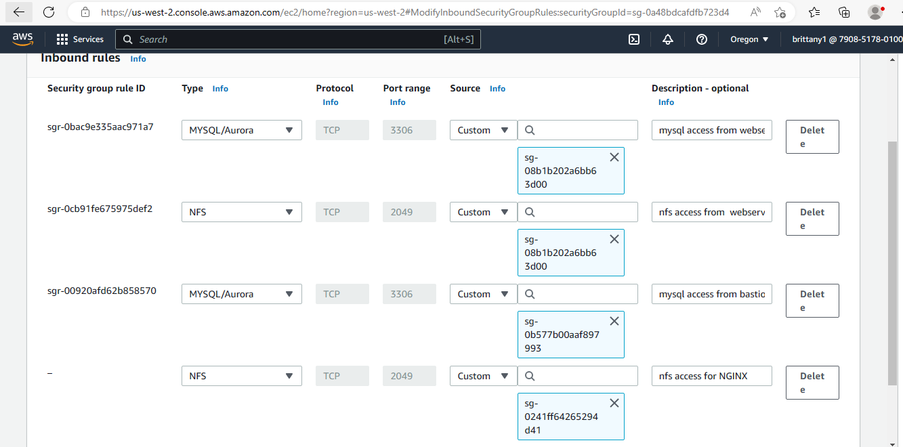
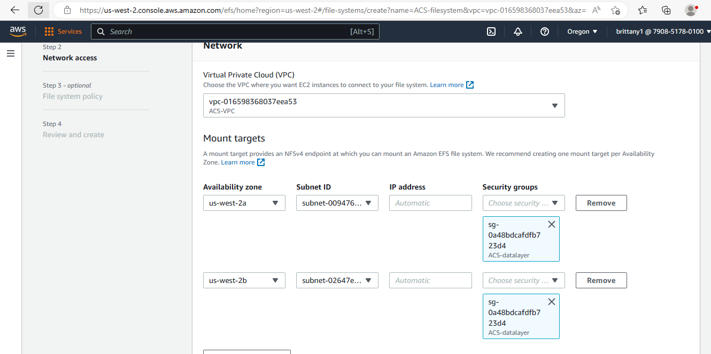
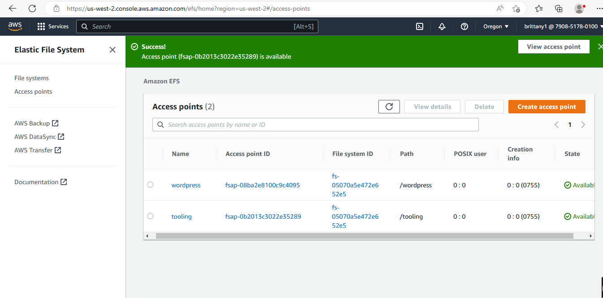
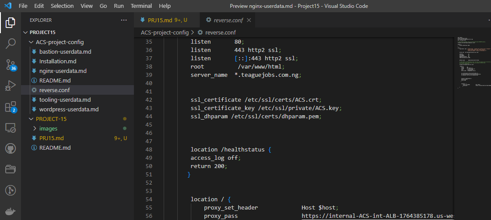

**SET UP A VIRTUAL PRIVATE NETWORK (VPC)**

1. Create  a vpc

2. Create internet Gateway for our vpc and attach

3. Create public subnets 1 and 2 on our AZ

4. Create Private subnets 1-4 on our AZ (USE ODD NUMBERS)

5. Create Route Tables

6. Associate the route tables to their respective subnets

7. Edit the public route tables

8. Create NAT gateway in order for us to associate it with our private route table,but firstly we need to allocate an elastic ip to our NAT gateway

9. Create a NAT GATEWAY and place it on any of our public subnets

10. Now edit the private route table and associate it with our NAT gateway

11. Create security groups for

- External Application load balancer
- NGINX

- Internal Application load balancer

- Webservers

- Data layer

- Bastion

12. Create TLS certificates From Amazon Certificate Manager (ACM)
You will need TLS certificates to handle secured connectivity to your Application Load Balancers (ALB).

1.  Create Elastic File System (EFS)

14. Create Access points for wordpress and tooling respectively

**Setup RDS**
Pre-requisite: Create a KMS key from Key Management Service (KMS) to be used to encrypt the database instance.

Amazon Relational Database Service (Amazon RDS) is a managed distributed relational database service by Amazon Web Services. This web service running in the cloud designed to simplify setup, operations, maintenans & scaling of relational databases. Without RDS, Database Administrators (DBA) have more work to do, due to RDS, some DBAs have become jobless

To ensure that yout databases are highly available and also have failover support in case one availability zone fails, we will configure a multi-AZ set up of RDS MySQL database instance. In our case, since we are only using 2 AZs, we can only failover to one, but the same concept applies to 3 Availability Zones. We will not consider possible failure of the whole Region, but for this AWS also has a solution – this is a more advanced concept that will be discussed in following projects.

To configure RDS, follow steps below:

1. Create a subnet group and add 2 private subnets (data Layer)
2. Create an RDS Instance for mysql 8.*.*
3. To satisfy our architectural diagram, you will need to select either Dev/Test or Production Sample Template. But to minimize AWS cost, you can select the Do not create a standby instance option under Availability & durability sample template (The production template will enable Multi-AZ deployment)
4. Configure other settings accordingly (For test purposes, most of the default settings are good to go). In the real world, you will need to size the database appropriately. You will need to get some information about the usage. If it is a highly transactional database that grows at 10GB weekly, you must bear that in mind while configuring the initial storage allocation, storage autoscaling, and maximum storage threshold.
5. Configure VPC and security (ensure the database is not available from the Internet)
6. Configure backups and retention
7. Encrypt the database using the KMS key created earlier
8. Enable CloudWatch monitoring and export Error and Slow Query logs (for production, also include Audit)

- Setup RDS subnet group

- Setup Database

1.  **Set Up Compute Resources for Bastion**
Provision the EC2 Instances for Bastion

- Create an EC2 Instance based on CentOS Amazon Machine Image (AMI) per each Availability Zone in the same Region and same AZ where you created Nginx server
- Ensure that it has the following software installed
- python
- ntp
- net-tools
- vim
- wget
- telnet
- epel-release
- htop

- Associate an Elastic IP with each of the Bastion EC2 Instances
- Create an AMI out of the EC2 instance

**Prepare Launch Template For Bastion (One per subnet)**

1. Make use of the AMI to set up a launch template
2. Ensure the Instances are launched into a public subnet
3. Assign appropriate security group
4. Configure Userdata to update yum package repository and install Ansible and git

**Configure Target Groups**

1. Select Instances as the target type
2. Ensure the protocol is TCP on port 22
3. Register Bastion Instances as targets
4. Ensure that health check passes for the target group

**Configure Autoscaling For Bastion**

1. Select the right launch template
2. Select the VPC
3. Select both public subnets
4. Enable Application Load Balancer for the AutoScalingGroup (ASG)
5. Select the target group you created before
6. Ensure that you have health checks for both EC2 and ALB
The desired capacity is 2
Minimum capacity is 2
Maximum capacity is 4
7. Set scale out if CPU utilization reaches 90%
8. Ensure there is an SNS topic to send scaling notifications

**Set Up Compute Resources for Nginx**
Provision EC2 Instances for Nginx

1. Create an EC2 Instance based on CentOS Amazon Machine Image (AMI) in any 2 Availability Zones (AZ) in any AWS Region (it is recommended to use the Region that is closest to your customers). Use EC2 instance of T2 family (e.g. t2.micro or similar)

2. Ensure that it has the following software installed:

python
ntp
net-tools
vim
wget
telnet
epel-release
htop

**Create an AMI out of the EC2 instance**

1. Prepare Launch Template For Nginx (One Per Subnet)
2.Make use of the AMI to set up a launch template
3. Ensure the Instances are launched into a public subnet
4. Assign appropriate security group
5. Configure Userdata to update yum package repository and install nginx

6. Configure Target Groups
7. Select Instances as the target type
8. Ensure the protocol HTTPS on secure TLS port 443
9. Ensure that the health check path is /healthstatus
10. Register Nginx Instances as targets
Ensure that health check passes for the target group
**Configure Autoscaling For Nginx**
1. Select the right launch template
2. Select the VPC
3. Select both public subnets
4. Enable Application Load Balancer for the AutoScalingGroup (ASG)
5. Select the target group you created before
6. Ensure that you have health checks for both EC2 and ALB
The desired capacity is 2
Minimum capacity is 2
Maximum capacity is 4
7. Set scale out if CPU utilization reaches 90%
8. Ensure there is an SNS topic to send scaling notifications

**Set Up Compute Resources for Webservers**

1. Provision the EC2 Instances for Webservers
2. Now, you will need to create 2 separate launch templates for both the WordPress and Tooling websites

3. Create an EC2 Instance (Centos) each for WordPress and Tooling websites per Availability Zone (in the same Region).

4. Ensure that it has the following software installed

python
ntp
net-tools
vim
wget
telnet
epel-release
htop
php

**Create an AMI out of the EC2 instance**

1. Prepare Launch Template For Webservers (One per subnet)
2. Make use of the AMI to set up a launch template
3. Ensure the Instances are launched into a public subnet
4. Assign appropriate security group
5. Configure Userdata to update yum package repository and install wordpress (Only required on the WordPress launch template)

**CONFIGURE APPLICATION LOAD BALANCER (ALB)**

Application Load Balancer To Route Traffic To NGINX
Nginx EC2 Instances will have configurations that accepts incoming traffic only from Load Balancers. No request should go directly to Nginx servers. With this kind of setup, we will benefit from intelligent routing of requests from the ALB to Nginx servers across the 2 Availability Zones. We will also be able to offload SSL/TLS certificates on the ALB instead of Nginx. Therefore, Nginx will be able to perform faster since it will not require extra compute resources to valifate certificates for every request.

1. Create an Internet facing ALB
2. Ensure that it listens on HTTPS protocol (TCP port 443)
3. Ensure the ALB is created within the appropriate VPC | AZ | Subnets
4. Choose the Certificate from ACM
5. Select Security Group
6. Select Nginx Instances as the target group

**Application Load Balancer To Route Traffic To Web Servers**
Since the webservers are configured for auto-scaling, there is going to be a problem if servers get dynamically scaled out or in. Nginx will not know about the new IP addresses, or the ones that get removed. Hence, Nginx will not know where to direct the traffic.

To solve this problem, we must use a load balancer. But this time, it will be an internal load balancer. Not Internet facing since the webservers are within a private subnet, and we do not want direct access to them.

Create an Internal ALB
Ensure that it listens on HTTPS protocol (TCP port 443)
Ensure the ALB is created within the appropriate VPC | AZ | Subnets
Choose the Certificate from ACM
Select Security Group
Select webserver Instances as the target group
Ensure that health check passes for the target group

NOTE: Instead for creating another internal load balancer for tooling target group we will add a a rule on our port 443 listeners to foward traffic host header to our tooling target group

**Setup EFS**
Amazon Elastic File System (Amazon EFS) provides a simple, scalable, fully managed elastic Network File System (NFS) for use with AWS Cloud services and on-premises resources. In this project, we will utulize EFS service and mount filesystems on both Nginx and Webservers to store data.

1. Create an EFS filesystem
2. Create an EFS mount target per AZ in the VPC, associate it with both subnets dedicated for data layer
Associate the Security groups created earlier for data layer.
3. Create an EFS access point. (Give it a name and leave all other settings as default)

**Configuring DNS with Route53**

Earlier in this project you registered a free domain with Freenom and configured a hosted zone in Route53. But that is not all that needs to be done as far as DNS configuration is concerned.

You need to ensure that the main domain for the WordPress website can be reached, and the subdomain for Tooling website can also be reached using a browser.

Create other records such as CNAME, alias and A records.

NOTE: You can use either CNAME or alias records to achieve the same thing. But alias record has better functionality because it is a faster to resolve DNS record, and can coexist with other records on that name. Read here to get to know more about the differences.

Create an alias record for the root domain and direct its traffic to the ALB DNS name.
Create an alias record for tooling.<yourdomain>.com and direct its traffic to the ALB DNS name.

